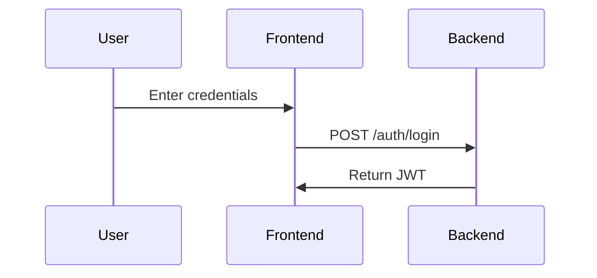
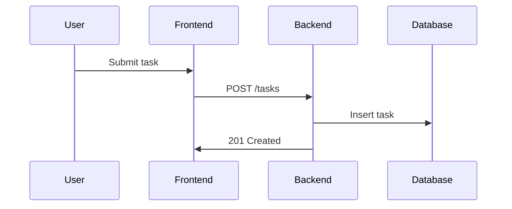
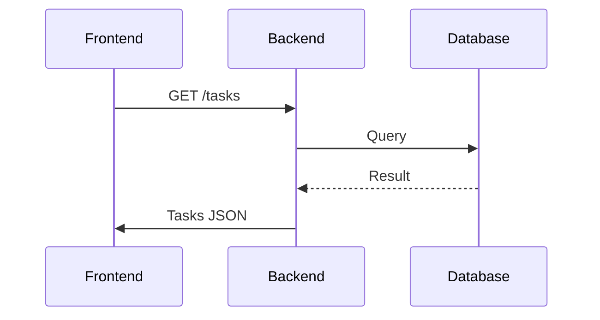
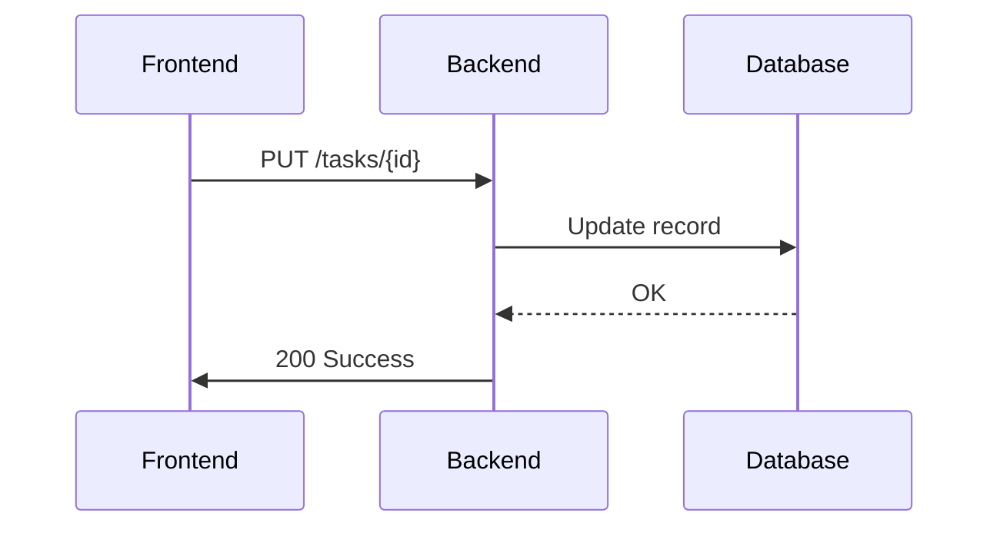

# Sequence Diagrams

## Login Flow

```mermaid
sequenceDiagram
    participant U as User
    participant FE as Frontend
    participant BE as Backend

    U ->> FE: Enter credentials
    FE ->> BE: POST /auth/login
    BE ->> FE: Return JWT
```

## Create Task Flow

```mermaid
sequenceDiagram
    participant U as User
    participant FE as Frontend
    participant BE as Backend
    participant DB as Database

    U ->> FE: Submit task
    FE ->> BE: POST /tasks
    BE ->> DB: Insert task
    BE ->> FE: 201 Created
```

## Retrieve Tasks Flow

```mermaid
sequenceDiagram
    participant FE as Frontend
    participant BE as Backend
    participant DB as Database

    FE ->> BE: GET /tasks
    BE ->> DB: Query
    DB -->> BE: Result
    BE ->> FE: Tasks JSON
```

## Update Task Flow

```mermaid
sequenceDiagram
    participant FE as Frontend
    participant BE as Backend
    participant DB as Database

    FE ->> BE: PUT /tasks/{id}
    BE ->> DB: Update record
    DB -->> BE: OK
    BE ->> FE: 200 Success
```
